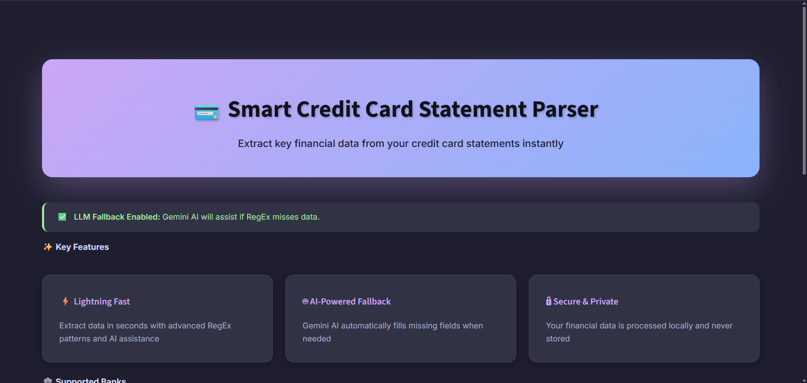
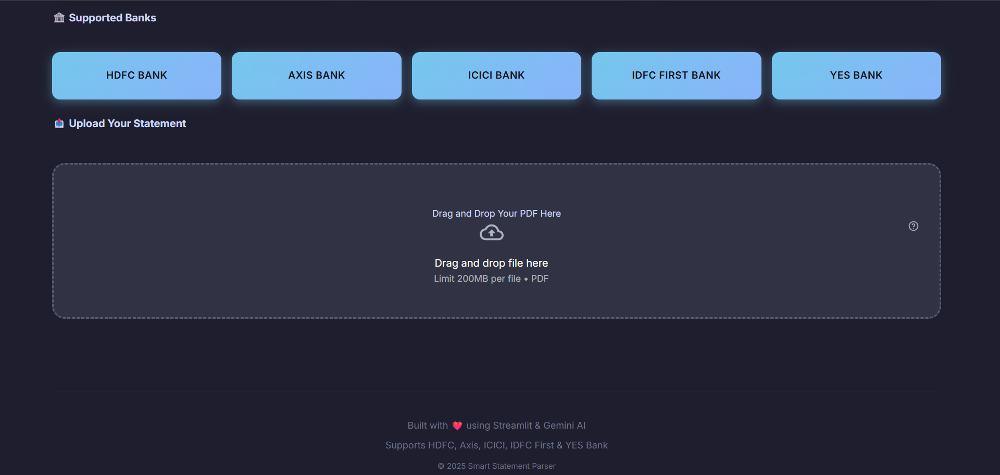
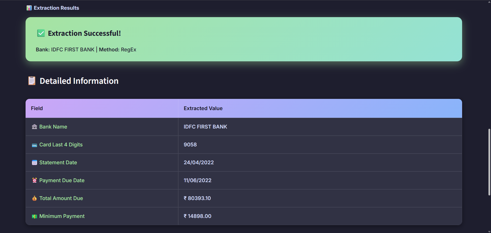

# 💳 Credit Card Statement Parser

A web application that extracts key information from credit card PDF statements using RegEx and AI.

## Features

- Extracts card number, dates, and payment amounts from PDF statements
- Supports HDFC, Axis, ICICI, IDFC First, and YES Bank
- Uses RegEx patterns with Google Gemini AI fallback
- Clean, modern UI with Catppuccin theme
- Drag-and-drop file upload

## Tech Stack

- **Frontend:** Streamlit
- **PDF Processing:** pdfplumber
- **AI:** Google Gemini API
- **Language:** Python 3.8+

## Installation

1. Clone the repository:

```cmd
git clone https://github.com/yourusername/credit-card-parser.git
cd credit-card-parser
```

2. Install dependencies:

```cmd
pip install -r requirements.txt
```

3. (Optional) Add Gemini API key in `.env`:

```text
GEMINI_API_KEY=your_api_key_here
```

## Usage

Run the application:

```cmd
streamlit run app.py
```

Upload your credit card statement PDF and view extracted data.

## Project Structure

```
├── app.py              # Main Streamlit app
├── parser.py           # PDF parsing logic
├── regex_patterns.py   # Bank-specific patterns
├── styles.py           # CSS styling
└── requirements.txt    # Dependencies
```

## Output

 <hr>
 <hr>
 <hr>


## How It Works

1. Upload PDF statement
2. Extract text using pdfplumber
3. Identify bank from text
4. Apply RegEx patterns to extract data
5. Use Gemini AI if any field is missing
6. Display results in a clean table

## Supported Banks

- HDFC Bank
- Axis Bank
- ICICI Bank
- IDFC First Bank
- YES Bank


Built with ❤️ using Streamlit and Gemini AI
